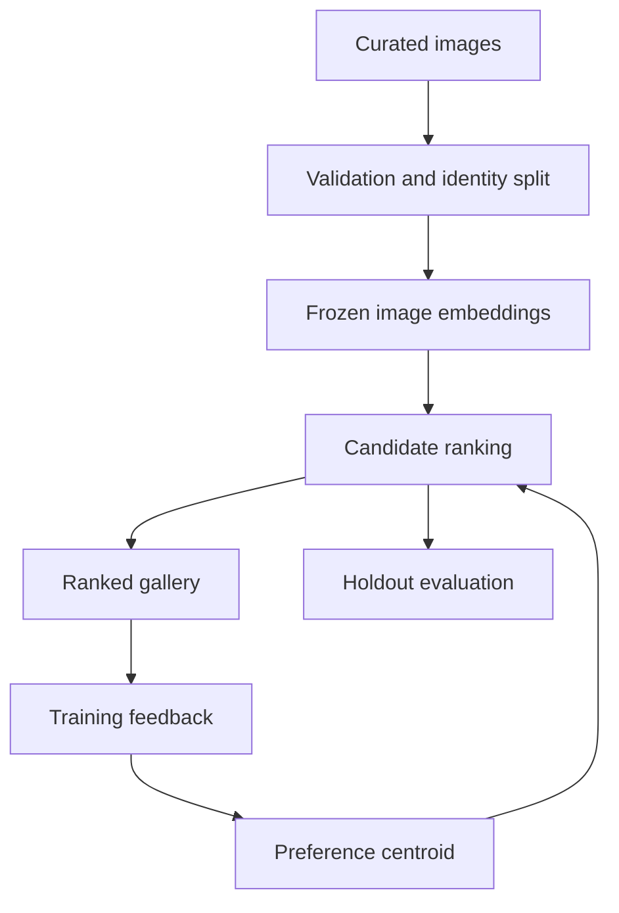

# Architecture and scope

Date: 2026-10-06
Status: image source and encoder pending selection.

## 1. Research question

Can frozen pretrained image representations and a small amount of explicit feedback rank unseen adult-person images according to an individual user's expressed preference better than random ordering?

The first user is the experiment participant. The portfolio audience should be able to inspect inputs, feedback, ranking changes and measured performance. The outcome is preference for an image, not compatibility, universal attractiveness or mutual matching.

## 2. V0.1 scope

Build a local, single-user, batch embedding pipeline with explicit feedback and a ranked gallery. Start with hundreds of curated images and stable identity groups, subject to source feasibility. Record actual dataset size and sampling strategy when selected.

Choose one encoder checkpoint after inspecting its license, preprocessing requirements, memory use and suitability. CLIP and SigLIP are candidates. Freeze the encoder for the first experiment.

Separate data, embedding extraction, preference representation, ranking and evaluation. Introduce dependencies only when required by the current increment.

## 3. Data and feedback contracts

Each image record includes image_id, relative local path, source reference, permitted-use metadata, file hash, identity_group_id, partition and available provenance. Record preprocessing and encoder versions with embeddings. Do not fabricate identity groups when the source does not provide identity evidence; resolve grouping or change the source before claiming identity-separated evaluation.

Check readability, dimensions, exact duplicates and potential near-duplicates before splitting. Select adult-only material using source documentation and curation, not model guesses about age.

Each feedback event includes user/session ID, image_id, label, timestamp and dataset version. Labels are like, dislike or skip. Skip is not a negative; missing feedback is not a label. Define a consistent prompt about preference for the displayed image. Record repeated judgments and label changes instead of silently overwriting history.

Keep raw images and real user feedback outside Git. Public demo assets require permitted redistribution; use synthetic/example feedback for demonstrations. Document the selected source's terms before ingestion.

## 4. Baseline ranking

Extract image vectors using the checkpoint's documented preprocessing. L2-normalize vectors and reject invalid or zero-norm outputs.

For liked training images, compute their mean normalized embedding and normalize that mean to obtain a preference centroid. Rank candidate vectors by cosine similarity to this centroid. With no positive feedback, return an explicit cold-start state and collect labels. If the centroid has negligible norm, report that the representation is undefined rather than returning arbitrary scores.

The positive-only baseline intentionally does not learn from dislikes. Preserve negative labels for evaluation and the later positive/negative learning comparison. Similarity scores are not calibrated preference probabilities. Use a stable image ID to break ties.

Benchmark 0 is repeated seeded random ordering on the same candidate pool. Benchmark 1 is the positive centroid. Advanced methods must demonstrate value relative to these references.

## 5. Flow and responsibilities

The feedback loop uses training candidates. Holdout evaluation is a separate frozen experiment and must not feed back into the centroid.

| Location | Responsibility |
| --- | --- |
| src/tinder_match_engine/data | Manifest, validation, provenance, duplicates and partitions |
| src/tinder_match_engine/vision | Image loading and documented encoder preprocessing |
| src/tinder_match_engine/embeddings | Frozen encoder inference and versioned embedding cache |
| src/tinder_match_engine/preferences | Feedback history and preference representation |
| src/tinder_match_engine/ranking | Candidate scoring, ordering and tie handling |
| src/tinder_match_engine/evaluation | Holdout metrics, random benchmark and label-budget curves |
| configs | Dataset version, encoder, seeds, split and metric choices |
| reports | Aggregate metrics and visual experiment outputs |
| notebooks | Exploration; reusable implementation remains in src |

Place the small demo entry point outside model logic. No agent or automation component is required by V0.1. Existing empty directories do not require speculative implementations.

## 6. Evaluation design

Split by identity into training, validation and held-out test groups. Exact and near-duplicate images must not cross partitions. Multiple photographs of one person must remain together. Specify whether evaluation candidates are one image per identity; this is preferred initially to avoid repeated identities dominating top-k.

Collect holdout labels in randomized presentation order before viewing ranked results. Use the same labeling prompt as training, and do not treat the centroid's rankings as ground truth. Reserve validation for method and parameter selection. Freeze the final test protocol before comparing methods.

Primary metrics are Precision@k and NDCG@k with binary relevance from explicit likes. Fix k after inspecting candidate-pool feasibility and before final testing. Exclude skipped items from the labeled evaluation pool and report the resulting selection limitation and all skip counts. If there are no relevant items, NDCG is undefined; report that case explicitly.

Report pool size, positive-label prevalence, labeled coverage and performance of seeded random rankings. Estimate uncertainty by resampling identity groups, recalculating rankings and metrics. Use paired comparisons on the same pools where appropriate. A single user cannot support claims about general user performance.

Measure label-budget curves by varying the training feedback count while keeping evaluation identities fixed. Choose training examples randomly for the baseline experiment; active selection is a later separate comparison. Document label inconsistency using repeated judgments on a small subset.

Define practical improvement criteria before opening the final test results. Negative results and uncertainty remain part of the report.

## 7. Reproducibility and checks

Record source, manifest hash, identity grouping, split assignments, preprocessing, encoder/checkpoint version, embedding dimension, feedback snapshot, seed, configuration and code revision.

Test important logic when implemented: identity separation, label parsing, normalization, cold start, centroid construction and ranking order. Use small synthetic vectors to test mathematical behavior without downloading an encoder during CI. Image ingestion and encoder integration checks are separate from these unit tests.

## 8. Visual outputs and limitations

The demo should show a candidate gallery, like/dislike/skip controls, label count, cold-start guidance and updated ordering. Explain that scores represent similarity to a preference representation. Display model outputs only after the user has submitted independent labels in evaluation mode.

Reports should show ranking examples, changes after feedback, label-budget curves and comparison with random ordering. Attractive galleries alone do not demonstrate ranking quality.

A pretrained encoder may emphasize lighting, pose, background or clothing. Subjective preference may change over time or contain several modes that a single centroid cannot represent. Document source demographic coverage and selection bias; do not infer sensitive attributes to fill missing metadata. Synthetic images, if used, limit conclusions to the synthetic collection until separately validated on real photographs.

## 9. Open decisions and completion

Data foundations must resolve image source, adult-only curation, permitted uses, identity evidence, sampling and duplicate policy. Then select the encoder and freeze evaluation pools, k and improvement criteria.

This documentation increment is complete when scope and pending decisions are explicit. V0.1 itself requires validated data, reproducible embeddings, the centroid and random baselines, an independent identity-separated evaluation, a working local gallery and a limitations report.

Later increments compare positive/negative preference models, active learning and ranking diagnostics. UI automation and conversational personalization require their own scope and success criteria after the baseline works.